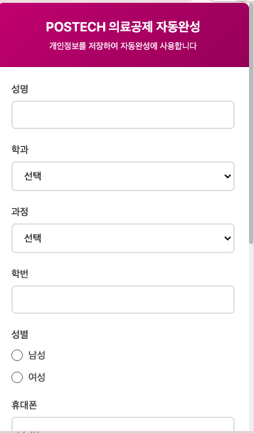
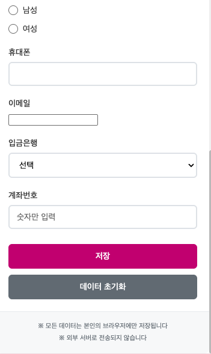
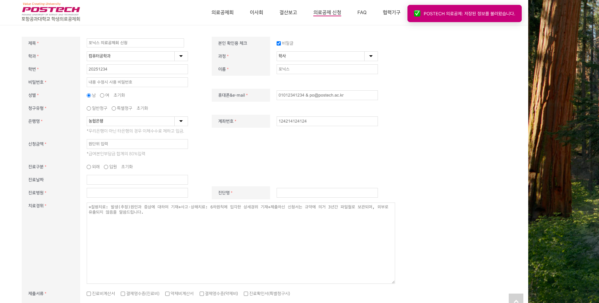

# POSTECH 의료공제 신청 자동완성

POSTECH 학생의료공제회 신청서를 자동으로 완성해주는 Chrome 확장 프로그램입니다.  

브라우저에서만 사용되고 정보를 외부로 보내지 않습니다.
[Chrome에 제출한 개인정보 방침 설명](privacy_policy.md)

## 기능

- POSTECH 의료공제 신청 폼 자동 입력
- 개인정보 저장 및 재사용
- 저장한 정보 변경/삭제

## 설치

[Chrome 확장 프로그램](https://chromewebstore.google.com/detail/postech-%EC%9D%98%EB%A3%8C%EA%B3%B5%EC%A0%9C-%EC%8B%A0%EC%B2%AD-%EC%9E%90%EB%8F%99%EC%99%84%EC%84%B1/gkpfphjlchpdoaofcadidgjnfkdpabka?hl=ko) 설치

## 사용법

### 1. 확장 프로그램을 열고 개인정보 입력 및 저장

### 2. [의료공제 신청 페이지](https://smcp.postech.ac.kr/apply-for-deduction/?mod=editor&pageid=1) 진입 시 입력된 개인정보가 자동으로 로딩됨

